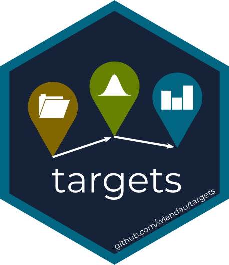

```{r, include = FALSE}
knitr::opts_chunk$set(
  collapse = TRUE,
  comment = "#>",
  fig.path = "man/figures/README-",
  out.width = "100%"
)
```

# targets 

[](https://www.repostatus.org/#wip)
[](https://github.com/wlandau/targets/actions?query=workflow%3Acheck)
[](https://github.com/wlandau/targets/actions?query=workflow%3Alint)
[](https://codecov.io/gh/wlandau/targets)

The `targets` package is a [Make](https://www.gnu.org/software/make/)-like pipeline toolkit for Statistics and data science in R. With `targets`, you can maintain a reproducible workflow without repeating yourself. `targets` learns how your pipeline fits together, skips costly runtime for tasks that are already up to date, runs only the necessary computation, supports implicit parallel computing, abstracts files as R objects, and shows tangible evidence that the results match the underlying code and data. For deep dives into why and how to use `targets`, please see the [user manual](https://wlandau.github.io/targets-manual).

## What about `drake`?

The [`drake`](https://github.com/ropensci/drake) package is an older and more established R-focused pipeline toolkit. It is has become a key piece of the R ecosystem, and development will continue. However, nearly four years of community feedback have exposed major user-side limitations regarding data management, collaboration, and parallel efficiency. Unfortunately, these limitations are permanent. Solutions in [`drake`](https://github.com/ropensci/drake) itself would make the package incompatible with existing projects that use it, and the internal architecture is too copious, elaborate, and mature for such extreme refactoring. That is why `targets` was created. The `targets` package borrows from past learnings, user suggestions, discussions, complaints, success stories, and feature requests, and it improves the user experience in ways that will never be possible in [`drake`](https://github.com/ropensci/drake). Please see the [statement of need](https://wlandau.github.io/targets/articles/need.html) for details.

## Installation

Install the GitHub development version to access the latest features and patches.

```{r, eval = FALSE}
library(remotes)
install_github("wlandau/targets")
```

## Examples

* [Minimal example](https://github.com/wlandau/targets-minimal).
* [Machine learning with Keras](https://github.com/wlandau/targets-keras).
* [Validating a Stan model](https://github.com/wlandau/targets-stan).

## Documentation

* [Manual](https://wlandau.github.io/targets-manual): deep dives into why and how to use `targets`.
* [Reference](https://wlandau.github.io/targets/): package website.
* [Functions](https://wlandau.github.io/targets/reference/index.html): documentation and examples of all user-side functions. 

## Specification

* [Statement of need](https://wlandau.github.io/targets/articles/need.html): the role of the `targets` package and why it was created alongside [`drake`](https://github.com/ropensci/drake).
* [Data management strategy and data store architecture](https://wlandau.github.io/targets/articles/need.html).
* [Orchestration](https://wlandau.github.io/targets/articles/orchestration.html): the mental model of target orchestration and dynamic branching.
* [Composition](https://wlandau.github.io/targets/articles/composition.html): the object composition structure of the `target` class and its fields.
* [OOP](https://wlandau.github.io/targets/articles/oop.html): the object oriented programming model of `targets`.

## Participation

Development is a community effort, and we welcome discussion and contribution. By participating in this project, you agree to abide by the [code of conduct](https://github.com/wlandau/targets/blob/master/CODE_OF_CONDUCT.md) and the [contributing guide](https://github.com/wlandau/targets/blob/master/CONTRIBUTING.md).
