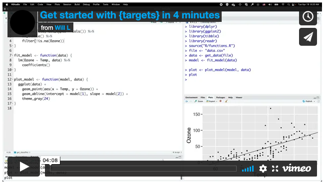

# targets 

[](https://github.com/ropensci/software-review/issues/401)
[](https://doi.org/10.21105/joss.02959)
[](https://zenodo.org/badge/latestdoi/200093430)
[](https://wlandau.github.io/targetopia/)
[](https://CRAN.R-project.org/package=targets)
[](https://www.repostatus.org/#active)
[](https://github.com/ropensci/targets/actions?query=workflow%3Acheck)
[](https://app.codecov.io/gh/ropensci/targets)
[](https://github.com/ropensci/targets/actions?query=workflow%3Alint)

The `targets` package is a
[Make](https://www.gnu.org/software/make/)-like pipeline tool for
statistics and data science in R. With `targets`, you can maintain a
reproducible workflow without repeating yourself. `targets` skips costly
runtime for tasks that are already up to date, orchestrates the
necessary computation with implicit parallel computing, and abstracts
files as R objects. An up-to-date `targets` pipeline is tangible
evidence that the output aligns with the code and data, which
substantiates trust in the results.

## Philosophy

A pipeline is a computational workflow that does statistics, analytics,
or data science. Examples include forecasting customer behavior,
simulating a clinical trial, and detecting differential expression from
genomics data. A pipeline contains tasks to prepare datasets, run
models, and summarize results for a business deliverable or research
paper. The methods behind these tasks are user-defined R functions that
live in R scripts, ideally in a folder called `"R/"` in the project. The
tasks themselves are called “targets”, and they run the functions and
return R objects. The `targets` package orchestrates the targets and
stores the output objects to make your pipeline efficient, painless, and
reproducible.

## Prerequisites

1.  Familiarity with the [R programming
    language](https://www.r-project.org/), covered in [R for Data
    Science](https://r4ds.had.co.nz/).
2.  [Data science workflow management
    techniques](https://rstats.wtf/index.html).
3.  [How to write functions](https://r4ds.had.co.nz/functions.html) to
    prepare data, analyze data, and summarize results in a data analysis
    project.

## Installation

| Type        | Source   | Command                                                           |
|-------------|----------|-------------------------------------------------------------------|
| Release     | CRAN     | `install.packages("targets")`                                     |
| Development | GitHub   | `remotes::install_github("ropensci/targets")`                     |
| Development | rOpenSci | `install.packages("targets", repos = "https://dev.ropensci.org")` |

## Get started in 4 minutes

The 4-minute video at <https://vimeo.com/700982360> demonstrates the
example pipeline used in the
[walkthrough](https://books.ropensci.org/targets/walkthrough.html) and
[functions](https://books.ropensci.org/targets/functions.html) chapters
of the [user manual](https://books.ropensci.org/targets/). Visit
<https://github.com/wlandau/targets-four-minutes> for the code and
<https://rstudio.cloud/project/3946303> to try out the code in a browser
(no download or installation required).

[](https://vimeo.com/700982360)

## Usage

To create a pipeline of your own:

1.  [Write R
    functions](https://books.ropensci.org/targets/functions.html) for a
    pipeline and save them to R scripts (ideally in the `"R/"` folder of
    your project).
2.  Call
    [`use_targets()`](https://docs.ropensci.org/targets/reference/use_targets.html)
    to write key files, including the vital `_targets.R` file which
    configures and defines the pipeline.
3.  Follow the comments in `_targets.R` to fill in the details of your
    specific pipeline.
4.  Check the pipeline with
    [`tar_visnetwork()`](https://docs.ropensci.org/targets/reference/tar_visnetwork.html),
    run it with
    [`tar_make()`](https://docs.ropensci.org/targets/reference/tar_make.html),
    and read output with
    [`tar_read()`](https://docs.ropensci.org/targets/reference/tar_read.html).
    [More
    functions](https://docs.ropensci.org/targets/reference/index.html)
    are available.

## Documentation

- [User manual](https://books.ropensci.org/targets/): in-depth
  discussion about how to use `targets`. The most important chapters are
  the
  [walkthrough](https://books.ropensci.org/targets/walkthrough.html),
  [help guide](https://books.ropensci.org/targets/help.html), and
  [debugging guide](https://books.ropensci.org/targets/debugging.html).
- [Reference website](https://docs.ropensci.org/targets/): formal
  documentation of all user-side functions, the statement of need, and
  multiple design documents of the internal architecture.
- [Developer documentation](https://books.ropensci.org/targets-design/):
  software design documents for developers contributing to the deep
  internal architecture of `targets`.

## Help

Please read the [help
guide](https://books.ropensci.org/targets/help.html) to learn how best
to ask for help using `targets`.

## Courses

- [Official half-day interactive
  tutorial](https://github.com/wlandau/targets-tutorial).

## Recorded talks

### English

- [Get started with `targets` in 4 minutes
  (4:08)](https://vimeo.com/700982360)
- [{targets} in
  Action](https://ropensci.org/commcalls/jan2023-targets/).
- [R/Medicine 2021 (15.33)](https://youtu.be/HJI5mQJRGpY)
- [R/Pharma 2020
  (9:24)](https://www.youtube.com/watch?v=GRqKJBaC5g4&list=PLMtxz1fUYA5C0YflXsR8EEAQXfjntlV1H&index=6)
- [LA R Users Meetup, October 2020
  (1:14:40)](https://www.youtube.com/watch?v=Qq25BUxpJu4)
- [New York Open Statistical Programming Meetup, December 2020
  (1:54:28)](https://youtu.be/Gqn7Xn4d5NI)
- [ds-incubator series,
  2021](https://www.youtube.com/playlist?list=PLvgdJdJDL-APJqHy5CXs6m4N7hUVp5rb4)
- [Lille R User Group, June 2021 (45:54)](https://youtu.be/FODSavXGjYg)

### Español

- [R-Ladies Barcelona, 2021-05-25
  (1:25:12)](https://www.youtube.com/watch?v=Vj312AfdpBo).

### 日本語

- [Bio”Pack”athon, 2022-03-31
  (1:04:10)](https://togotv.dbcls.jp/20220331.html)

## Example projects

- [Four-minute example](https://github.com/wlandau/targets-four-minutes)
- [Minimal example](https://github.com/wlandau/targets-minimal)
- [Machine learning with
  Keras](https://github.com/wlandau/targets-keras)
- [Validate a minimal Stan
  model](https://github.com/wlandau/targets-stan)
- [Using Target Markdown and `stantargets` to validate a Bayesian
  longitudinal model for clinical trial data
  analysis](https://github.com/wlandau/rmedicine2021-pipeline)
- [Shiny app that runs a
  pipeline](https://github.com/wlandau/targets-shiny)
- [Deploy a pipeline to RStudio
  Connect](https://github.com/sol-eng/targets-deployment-rsc)

## Apps

- [`tar_watch()`](https://docs.ropensci.org/targets/reference/tar_watch.html):
  a built-in Shiny app to visualize progress while a pipeline is
  running. Available as a Shiny module via
  [`tar_watch_ui()`](https://docs.ropensci.org/targets/reference/tar_watch_ui.html)
  and
  [`tar_watch_server()`](https://docs.ropensci.org/targets/reference/tar_watch_server.html).
- [`targetsketch`](https://wlandau.shinyapps.io/targetsketch): a Shiny
  app to help sketch pipelines
  ([app](https://wlandau.shinyapps.io/targetsketch),
  [source](https://github.com/wlandau/targetsketch)).

## Deployment

- <https://solutions.rstudio.com/r/workflows/> explains how to deploy a
  pipeline to RStudio Connect ([example
  code](https://github.com/sol-eng/targets-deployment-rsc)).
- [`tar_github_actions()`](https://docs.ropensci.org/targets/reference/tar_github_actions.html)
  sets up a pipeline to run on GitHub Actions. The [minimal
  example](https://github.com/wlandau/targets-minimal) demonstrates this
  approach.

## Extending and customizing targets

- [R Targetopia](https://wlandau.github.io/targetopia/): a collection of
  [R packages](https://wlandau.github.io/targetopia/packages.html) that
  extend `targets`. [These
  packages](https://wlandau.github.io/targetopia/packages.html) simplify
  pipeline construction for specific fields of Statistics and data
  science.
- [Target
  factories](https://wlandau.github.io/targetopia/contributing.html#target-factories):
  a programming technique to write specialized interfaces for custom
  pipelines. Posts [here](https://ropensci.org/blog/2021/02/03/targets/)
  and [here](https://wlandau.github.io/targetopia/contributing.html)
  describe how.

## Code of conduct

Please note that this package is released with a [Contributor Code of
Conduct](https://ropensci.org/code-of-conduct/).

## Citation

``` r
citation("targets")

To cite targets in publications use:

  Landau, W. M., (2021). The targets R package: a dynamic Make-like
  function-oriented pipeline toolkit for reproducibility and
  high-performance computing. Journal of Open Source Software, 6(57),
  2959, https://doi.org/10.21105/joss.02959

A BibTeX entry for LaTeX users is

  @Article{,
    title = {The targets R package: a dynamic Make-like function-oriented pipeline toolkit for reproducibility and high-performance computing},
    author = {William Michael Landau},
    journal = {Journal of Open Source Software},
    year = {2021},
    volume = {6},
    number = {57},
    pages = {2959},
    url = {https://doi.org/10.21105/joss.02959},
  }
```
