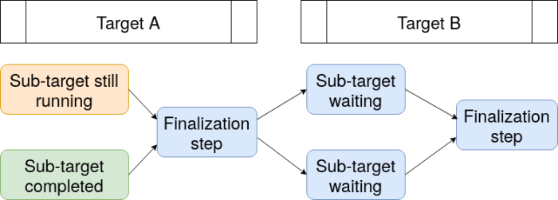
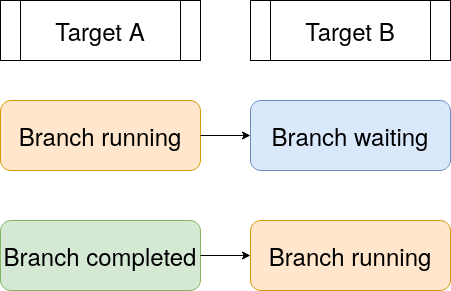

```{r setup, include = FALSE}
library(dplyr)
library(targets)
```

# Role

[Make](https://www.gnu.org/software/make/)-like [pipeline toolkits](https://github.com/pditommaso/awesome-pipeline) enhance the reproducibility, efficiency, and hygiene of large data science projects. Pipelines orchestrate tasks such as data munging, model fitting, summaries, and R Markdown reports, while skipping tasks that are already up to date with the underlying code and upstream data. With pipelines, we save time, and we have evidence to inform which results we can trust. `targets` is such a pipeline tool, and its major benefits are as follows.

Benefit | Description
---|---|---
Efficiency | Orchestrates the pipeline, running computational tasks in parallel when possible and skipping tasks that are already up to date.
Reproducibility | Detects when all targets are already up to date, which provides tangible evidence that results match the underlying code and data.
Maintainability | Nudges users toward a clean function-oriented programming style, and it abstracts output data as R objects.
Portability | Saves only one file per target in the data store and gives files informative names to allow users to more easily understand their data and collaborate on projects.
Domain specificity | Designed to work entirely within the R language.

Myriad workflow tools already exist, but most of them have different goals and behaviors. Different tools suit different situations.

Tool | Issues and differences
---|---
[pditmmaso/awesome-pipeline](https://github.com/pditommaso/awesome-pipeline) | Most tools listed are not for R.
[Metaflow](https://github.com/netflix/metaflow) | Resembles [Airflow](https://github.com/apache/airflow/) more than [GNU Make](https://www.gnu.org/software/make/). Features include versioned runs and seamless cloud integration, but not automated decision-making about which steps to skip.
[GNU Make](https://www.gnu.org/software/make/) | Not designed for a function-oriented style in R.
[`remake`](https://github.com/richfitz/remake) | No longer maintained.
[`drake`](https://github.com/ropensci/drake) | Permanent systemic limitations on portability, reproducibility, parallel efficiency, dynamic branching, user-side guardrails, and metaprogramming.
[`memoise`](https://github.com/r-lib/memoise) | Operates on individual functions, not on a pipeline as a whole.
[`knitr`](https://yihui.name/knitr/), [`rmarkdown`](https://github.com/rstudio/rmarkdown), [`workflowr`](https://github.com/jdblischak/workflowr), and related | Designed for literate programming and communication. Not designed to scale in the same ways as pipeline tools, but useful for small components of pipelines.
[Git](https://git-scm.com/) | Designed for version control, not pipeline management specifically, but recommended for use with pipelines. 
[`renv`](https://github.com/rstudio/renv), [Docker](https://www.docker.com/), and related | Designed for package environment management and containerization. Not pipeline management specifically, but recommended for use with pipelines.

# drake

The [`drake`](https://github.com/ropensci/drake) package is an older and more established R-focused pipeline toolkit. It is has become a key piece of the R ecosystem, and development and support will continue. Future efforts will focus on the issues that bring the most concrete value to users: requested features, performance improvements for known inefficiencies, bug fixes, documentation, education, and prompt one-on-one help. Existing `drake`-powered projects can safely continue to use `drake`, and there is no urgency to migrate to `targets`.

However, nearly four years of community feedback have exposed major user-side limitations regarding data management, collaboration, dynamic branching, and parallel efficiency. Unfortunately, these limitations are permanent. Solutions in [`drake`](https://github.com/ropensci/drake) itself would make the package incompatible with existing projects that use it, and the internal architecture is too copious, elaborate, and mature for such extreme refactoring. That is why `targets` was created. The `targets` package borrows from past learnings, user suggestions, discussions, complaints, success stories, and feature requests, and it improves the user experience in ways that will never be possible in [`drake`](https://github.com/ropensci/drake).

## Better guardrails by design

[`drake`](https://github.com/ropensci/drake) leaves ample room for user-side mistakes, and some of these mistakes require extra awareness or advanced knowledge of R to consistently avoid. The example behaviors below are too systemic to solve and still preserve back-compatibility.

1. By default, `make()` looks for functions and global objects in the parent environment of the calling R session. Because the global environment is often old and stale in practical situations, which causes targets to become incorrectly invalidated. Users need to remember to restart the session before calling `make()`. The issue is [discussed here](https://github.com/ropensci/drake/issues/761), and the discussion led to functions like `r_make()` which always create a fresh session to do the work. However, `r_make()` is not a complete replacement for `make()`, and beginner users still run into the original problems. 
1. Similar to the above, `make()` does not find the intended functions and global objects if it is called in a different environment. Edge cases like [this one](https://github.com/ropensci/drake/issues/874) and [this one](https://github.com/ropensci/drake/issues/527) continue to surprise users.
1. [`drake`](https://github.com/ropensci/drake) is extremely flexible about the location of the `.drake/` cache. When a user calls `readd()`, `loadd()`, `make()`, and similar functions, [`drake`](https://github.com/ropensci/drake) searches up through the parent directories until it finds a `.drake/` folder. This flexibility seldom helps, and it creates uncertainty and inconsistency when it comes to initializing and accessing projects, especially if there are multiple projects with nested file systems.

The `targets` package solves all these issues by design. Functions `tar_make()`, `tar_make_clustermq()`, and `tar_make_future()` all create fresh new R sessions by default. They all require a `_targets.R` configuration file in the project root (working directory of the `tar_make()` call) so that the functions, global objects, and settings are all populated in the exact same way each session, leading to less frustration, greater consistency, and greater reproducibility. In addition, the `_targets/` data store always lives in the project root.

## Lighter, friendlier data management

[`drake`](https://github.com/ropensci/drake)'s cache is an intricate file system in a hidden `.drake` folder. It contains multiple files for each target, and those names are not informative. (See the files in the `data/` folder in the diagram below.) Users often have trouble understanding how [`drake`](https://github.com/ropensci/drake) manages data, resolving problems when files are corrupted, placing the data under version control, collaborating with others on the same pipeline, and clearing out superfluous data when the cache grows large in storage.

```
.drake/
├── config/
├── data/
├───── 17bfcef645301416.rds
├───── 21935c86f12692e2.rds
├───── 37caf5df2892cfc4.rds
├───── ...
├── drake/
├───── history/
├───── return/
├───── tmp/
├── keys/ # A surprisingly large number of tiny text files live here.
├───── memoize/
├───── meta/
├───── objects/
├───── progress/
├───── recover/
├───── session/
└── scratch/ # This folder should be temporary, but it gets egregiously large.
```

The `target` takes a friendlier, more transparent, less mysterious approach to data management. Its data store is a visible `_targets` folder, and it contains far fewer files: a spreadsheet of metadata, a spreadsheet of target progress, and one informatively named data file for each target. It is much easier to understand the data management process, identify and diagnose problems, place projects under version control, and avoid consuming unnecessary storage resources. Sketch:

```
_targets/
├── meta/
├───── meta
├───── progress
├── objects/
├───── target_name_1
├───── target_name_2
├───── target_name_3
├───── ...
└── scratch/ # Deleted when the pipeline finishes.
```

## Show status of functions and global objects

[`drake`](https://github.com/ropensci/drake) has several utilities that inform users which targets are up to date and which need to rerun. However, those utilities are limited by how [`drake`](https://github.com/ropensci/drake) manages functions and other global objects. Whenever [`drake`](https://github.com/ropensci/drake) inspects globals, it stores their values in its cache and loses track of their previous state from the last run of the pipeline. As a result, it has trouble informing users exactly why a given target is out of date. And because the system for tracking global objects is tightly coupled with the cache, this limitation is permanent.

In `targets`, the metadata management system only updates information on global objects when the pipeline actually runs. This makes it possible to understand which specific changes to your code could have invalided your targets. In large projects with long runtimes, this feature contributes significantly to reproducibility and peace of mind.


## Dynamic branching with `dplyr::group_by()`

[Dynamic branching](https://books.ropensci.org/drake/dynamic.html) was an architecturally difficult fit in [`drake`](https://github.com/ropensci/drake), and it can only support one single ([`vctrs`](https://r-lib.github.io/vctrs)-based) method of slicing and aggregation for processing sub-targets. This limitation has frustrated members of the community, as discussed [here](https://github.com/ropensci/drake/issues/1087) and [here](https://github.com/ropensci/drake/issues/1170).

`targets`, on the other hand, is more flexible regarding slicing and aggregation. When it branches over an object, it can iterate over vectors, lists, and even data frames grouped with `dplyr::group_by()`. To branch over chunks of a data frame, our data frame target needs to have a special `tar_group` column. We can create this column in our target's return value with the `tar_group()` function.

```{r}
library(dplyr)
library(targets)
data.frame(
  x = seq_len(6),
  id = rep(letters[seq_len(3)], each = 2)
) %>%
  group_by(id) %>%
  tar_group()
```

Our actual target has the command above and `iteration = "group"`.

```{r, eval = FALSE}
tar_target(
  data,
  data.frame(
    x = seq_len(6),
    id = rep(letters[seq_len(3)], each = 2)
  ) %>%
    group_by(id) %>%
    tar_group(),
  iteration = "group"
)
```

Now, any target that maps over `data` is going to define one branch for each group in the data frame. The following target creates three branches when run in a pipeline: one returning 3, one returning 7, and one returning 11.

```{r, eval = FALSE}
tar_target(
  sums,
  sum(data$x),
  pattern = map(data)
)
```

## Improved parallel efficiency

[Dynamic branching](https://books.ropensci.org/drake/dynamic.html) in [`drake`](https://github.com/ropensci/drake) is staged. In other words, all the sub-targets of a dynamic target must complete before the pipeline moves on to downstream targets. The diagram below illustrates this behavior in a pipeline with a dynamic target B that maps over another dynamic target A. For thousands of dynamic sub-targets with highly variable runtimes, this behavior consumes unnecessary runtime and computing resources. And because [`drake`](https://github.com/ropensci/drake)'s architecture was designed at a fundamental level for static branching only, this limitation is permanent.



By contrast, the internal data structures in `targets` are dynamic by design, which allows for a dynamic branching model with more flexibility and parallel efficiency. Branches can always start as soon as their upstream dependencies complete, even if some of those upstream dependencies are branches. This behavior reduces runtime and reduces consumption of computing resources.



## Metaprogramming

In [`drake`](https://github.com/ropensci/drake), pipelines are defined with the `drake_plan()` function. `drake_plan()` supports an elaborate domain specific language that diffuses user-supplied R expressions. This makes it convenient to assign commands to targets in the vast majority of cases, but it also obstructs custom metaprogramming by users ([example here](https://github.com/ropensci/drake/issues/1251)). Granted, it is possible to completely circumvent `drake_plan()` and create the whole data frame from scratch, but this is hardly ideal and seldom done in practice.

The `targets` package tries to make customization easier. Relative to `drake`, `targets` takes a decentralized approach to setting up pipelines, moving as much custom configuration as possible to the target level rather than the whole pipeline level. In addition, the `tar_target_raw()` function avoids non-standard evaluation while mirroring `tar_target()` in all other respects. All this makes it much easier to create [custom metaprogrammed pipelines](https://wlandau.github.io/targets-manual/static.html#metaprogram) and [target archetypes](https://github.com/wlandau/tarchetypes) while avoiding an elaborate domain specific language for [static branching](https://books.ropensci.org/drake/static.html), which was extremely difficult to understand and error prone in [`drake`](https://github.com/ropensci/drake).
