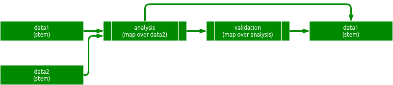
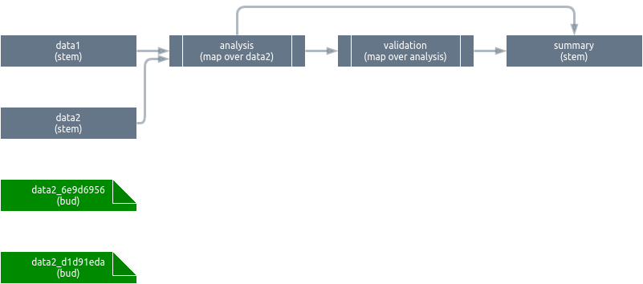
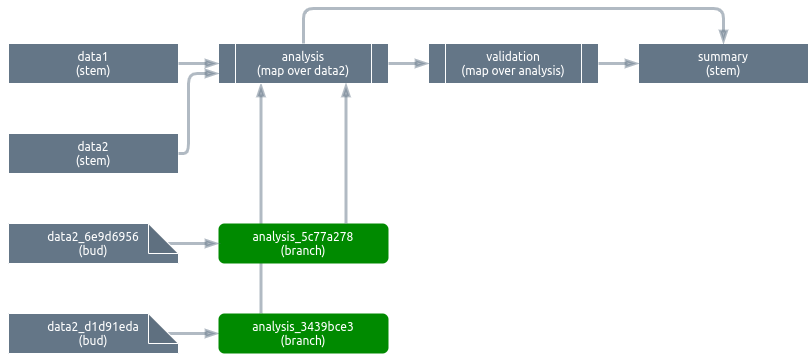
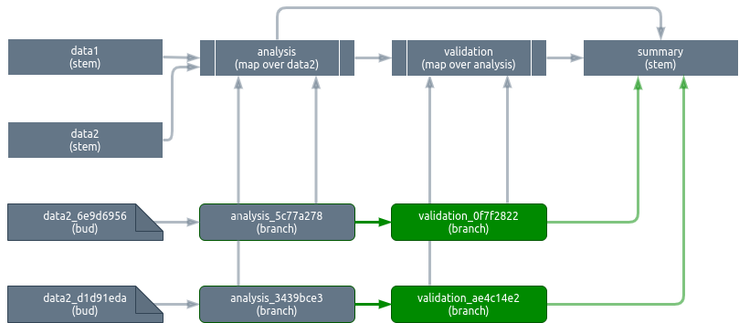

The `targets` package runs the correct targets in the correct order (orchestration) and creates new targets dynamically at runtime (branching). This vignette describes the underlying package structure and mental model that gives `targets` its flexibility and parallel efficiency.

# Structure

`targets` relies heavily on object-oriented programming, and the following subsections describe the hierarchy and composition of the objects relevant to orchestration and branching. Objects that appear once per workflow are instances of `R6` classes. To maximize performance, target-specific data structures are lower-tech classes: simple environments with formal constructors, helpers, and validators.

## Algorithm class

An algorithm in `targets` is an abstract class that represents how to iterate through the pipeline target by target. Different algorithms describe different kinds of deployment: for example, execution in the main process on the host machine versus parallel execution on a cluster. Every algorithm has a scheduler object and a pipeline object.

## Pipeline class

A pipeline is a wrapper around a collection of targets, and it is responsible for the initial reasoning about the topology of the pipeline before runtime. Pipelines express their reasoning by producing static graphs and scheduler objects early on. In addition, pipelines contain new buds and branches created dynamically during the pipeline.

## Scheduler class

Whereas pipelines are responsible for *static* topology, schedulers are responsible for *dynamic* topology. Schedulers know

1. The upstream and downstream neighbors of each target.
1. The progress of each target, e.g. queued, running, or finished.
1. How many upstream dependencies need to be checked or built before a target is ready to run.

To meet these responsibilities, the scheduler is composed of three smaller objects:

1. A graph object.
1. A progress object.
1. A priority queue.

## Graph class

The graph class keeps track of the upstream and downstream neighbors of each target. The scheduler adds edges to the graph when new targets are created dynamically.

The graph is implemented as two adjacency lists: one for upstream edges and another for downstream edges. For the purposes of powering a pipeline, we find this low-tech structure to be more efficient than `igraph` in our situation where we repeatedly query the graph and the number of nodes is small. (Transient `igraph` objects, however, are created for validation and visualization purposes.)

## Progress class

The progress class keeps track of the state of each target: queued, running, skipped, built, outdated, canceled, or errored. To accomplish this, the progress object maintains a counter object for each category.

## Queue class

The queue class is a priority queue, essentially a wrapper around a named integer vector of ranks. For `targets`' purposes, the rank of a target is the number of unmet dependencies so far, minus a per-target priority value in the interval `[0, 1)` to control the order in which targets are dequeued. As the pipeline progresses, the queue is checked and modified periodically as dependencies are met. The next target to build is the lowest rank target such that `-1L < rank <= 0L`. Branches are pushed to the queue when they are dynamically created.

## Counter class

A counter is an efficient abstraction for keeping track of target membership in a category. A counter stores the number of targets in the category and a hash table with the names of those targets. Counters are used to efficiently keep track of runtime progress (e.g. running, queued, or built) as well membership in the queue.

## Target class

A target is an abstract class for a step of a pipeline. Each target is a composite of intricate sub-classes that keep track of commands, in-memory dependencies, storage, settings, and some aspects of build behavior. As its name implies, the `targets` package pushes most of its conceptual complexity  to the target level in order to decentralize the architecture and make it much easier to reason about the pipeline as a whole.

There are multiple sub-classes of targets, and the different behaviors of different sub-classes drive the orchestration and branching of targets. The inheritance hierarchy is as follows.

* Target
    * Bud
    * Builder
        * Stem
        * Branch
    * Pattern

## Stem class

A stem is the most basic form of target. It is neither a pattern nor part of a pattern. However, it can dynamically create buds to assist with branching.

## Bud class

A bud is a target that simply contains part of a stem's value in memory. The purpose of a bud is to serve as a dependency of a branch when a pattern branches over a stem.

## Pattern class

A pattern is an abstract class responsible for creating new branches and dynamically updating the scheduler. Stems and patterns are the only targets the user manually defines in the pipeline.


## Branch class

A branch is a target that a pattern creates dynamically at runtime.

## Builder class

Stems and branches have a lot in common: they actually run R commands, and the write the return values to storage. A builder is an abstract class to contain the heavy lifting that stems and branches both do.

## Junction class

A junction is a manifest of the buds or branches (children) that a stem or pattern dynamically creates, and it depends on the user-specified `pattern` argument to `tar_target()`, e.g. `tar_target(..., pattern = cross(x, map(y, z)))`.

# Orchestration

To orchestrate targets, we iterate on the following loop while there is still at least one target in the queue.

1. If the target at the head of the queue is not ready to build (rank > 0) sleep for a short time.
1. If the target at the head of the queue is ready to build (rank = 0) do the following:
    a. Dequeue the target.
    a. Run the target's `prepare()` method.
    a. Run the target's `run()` method.
    a. Run the target's `conclude()` method to updates the whole scheduler.
    a. Unload transient targets from memory.

The usual behavior of `prepare()`, `run()`, and `conclude()` is as follows.

Method | Responsibilities
---|---
`prepare()` | Announce the target to the console, load dependencies into memory, and register the target as running.
`run()` | Run the R command and create an object to contain the results.
`conclude()` | Store the value and update the scheduler, create new buds and branches as needed, and register the target as built.

The specific behavior of `prepare()`, `run()`, and `conclude()` depends on the sub-class of the target. For example, `run()` does nontrivial work in builders (stems and branches) but does nothing in all other classes. The `conclude()` method is where stems and patterns update the scheduler and spawn new buds and branches dynamically. Two of the most important responsibilities of `conclude()` are 

1. Decrement the ranks of downstream targets in the priority queue.
1. Insert new targets dynamically.

For patterns, `conclude()` is called twice: once to spawn branches, and then again when all the branches are done.

## Decrement the ranks of downstream targets in the priority queue.

The `conclude()` method decrements ranks in the priority queue to signal that downstream neighbors are one step closer to being ready to build. Most targets decrement all their downstream neighbors, but a pattern only decrement the neighbors that branch over it. This behavior for patterns is key because it allows future patterns to quickly define new branches before the current ones even start running, which contributes to parallel efficiency.

## Insert new targets dynamically.

`targets` creates new targets dynamically when stems and patterns conclude. To illustrate, let us use the following example pipeline.

```{r, eval = FALSE}
# _targets.R
library(targets)
source("functions.R") # Defines all the functions below prefixed with "user_".
tar_pipeline(
  tar_target(data1, user_data1()),
  tar_target(data2, list(user_data2_slice1(), user_data2_slice2())),
  tar_target(analysis, user_analyze(data2), pattern = map(data2)),
  tar_target(validation, user_validate(analysis), pattern = map(analysis)),
  tar_target(summary, user_summarize(validation)) # Does not map over validation.
)
```

In prose:

* The `data` and `data2` targets are starting datasets.
* The `analysis` target maps over the rows of `data2` and performs a statistical analysis on each row. All analyses use the entirety of `data1`.
* The `validation` target maps over the analyses to check each one for correctness.
* The `summary` target aggregates and summarizes all the analyses and validations together.

Graphical representation:



### Insert buds

Upon conclusion, `data2` creates buds to help its downstream neighbor `analysis` map over it later on. `data1` creates no buds because no pattern branches over it.



To insert the buds, we:

1. Create a new junction with the names of the buds to create.
1. Create new bud objects, each containing a slice of `data2`'s return value.
1. Insert the buds into the pipeline object.

We do not need to update the scheduler because the parent stem of the buds already completed. In other words, buds are born built. They exist as separate data objects in memory, but they have no dedicated storage.

### Insert branches

With the buds in place, the `analysis` pattern can now create branches that depend on each of the respective buds of `data2`. After they run, the branches exist as separate data objects in memory and storage. The full aggregated `analysis` pattern is not needed, so it is never created.



As soon as these first branches are created, we can create the branches for `validation`. It does not matter if `analysis_5c77a278` and `analysis_3439bce3` are both still queued. In addition, as soon as `analysis_5c77a278` is built, `validation_0f7f2822` can start building regardless of whether `analysis_3439bce3` is complete. This is a major source of parallel efficiency.

Notice that we never draw edges from the `validation_*` branches to `summary`. This is because `summary` does not map over `validation`, so it automatically takes in all of `validation` as an entire aggregated pattern. In the `prepare()` method of `summary`, `validation` is constructed from its individual branches kept in memory while it is needed. Unlike the `validation_*` branches, the aggregated `validation` pattern does not persist in storage.



The fine details of the branching algorithm are as follows.

1. First we create a junction to describe the branches we will create based on the user-supplied `pattern` argument to `tar_target()`.
1. Create and insert those new branches into the pipeline.
1. Draw graph edges to connect the branches to their individual upstream dependencies (buds or branches).
1. Insert graph edges from the new branches to their parent pattern. Some targets may use the entire pattern in aggregate instead of iterating over individual branches, and this step makes sure all the branches are available for aggregation before a downstream target needs to use the aggregate.
1. Push the branches onto the priority queue. The rank for each branch is the number of upstream dependencies that still need to be checked or built. 1. Increment the priority queue ranks of all downstream non-branching targets by the number of new branches just created minus 1. This ensures all the branches complete before any target calls upon the entire aggregate of the pattern.
1. Register the branches as queued in the scheduler.
1. Push the pattern itself back onto the queue, where the priority queue rank now equals the number of branches minus a constant between 0 and 1. (The subtracted constant just ensures the pattern gets cleaned up as soon as possible.) This step ensures we revisit the pattern after all the branches are done. At that moment, we decrement the priority queue rank of every downstream target that depends on the entire aggregated pattern (as opposed to just a single branch). This behavior drives implicit aggregation, and it ensures we do not need a special `combine()` pattern directive to accompany `map()` and `cross()`.
